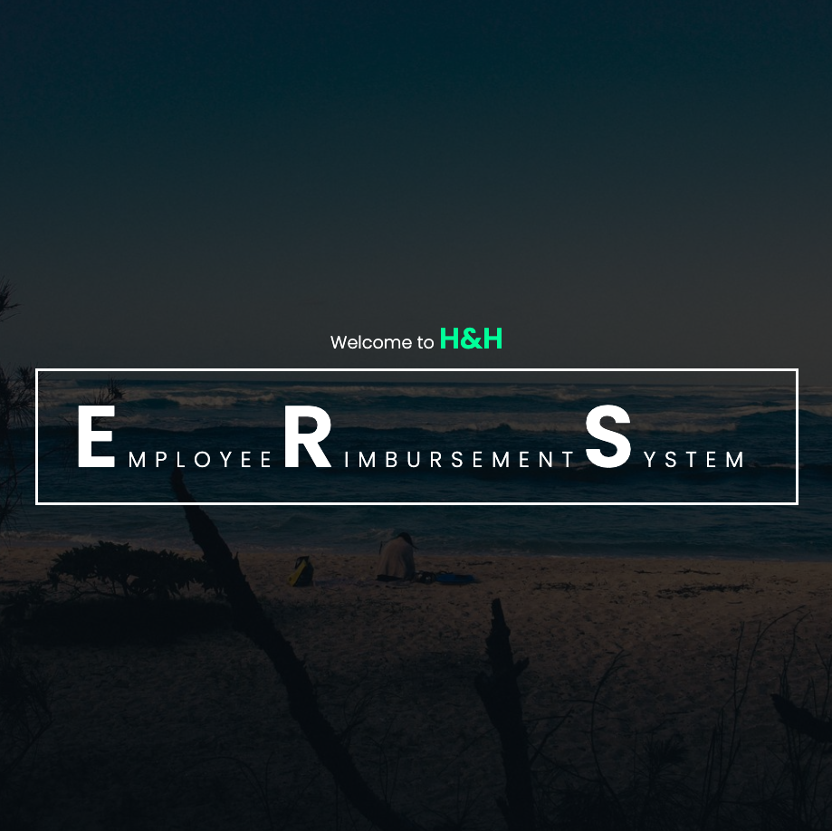
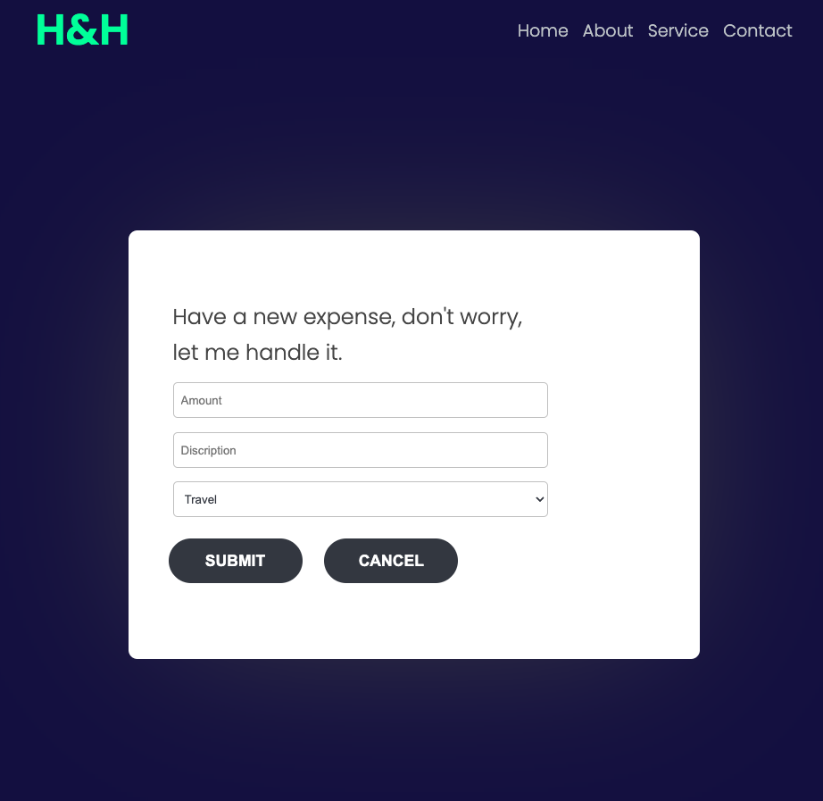
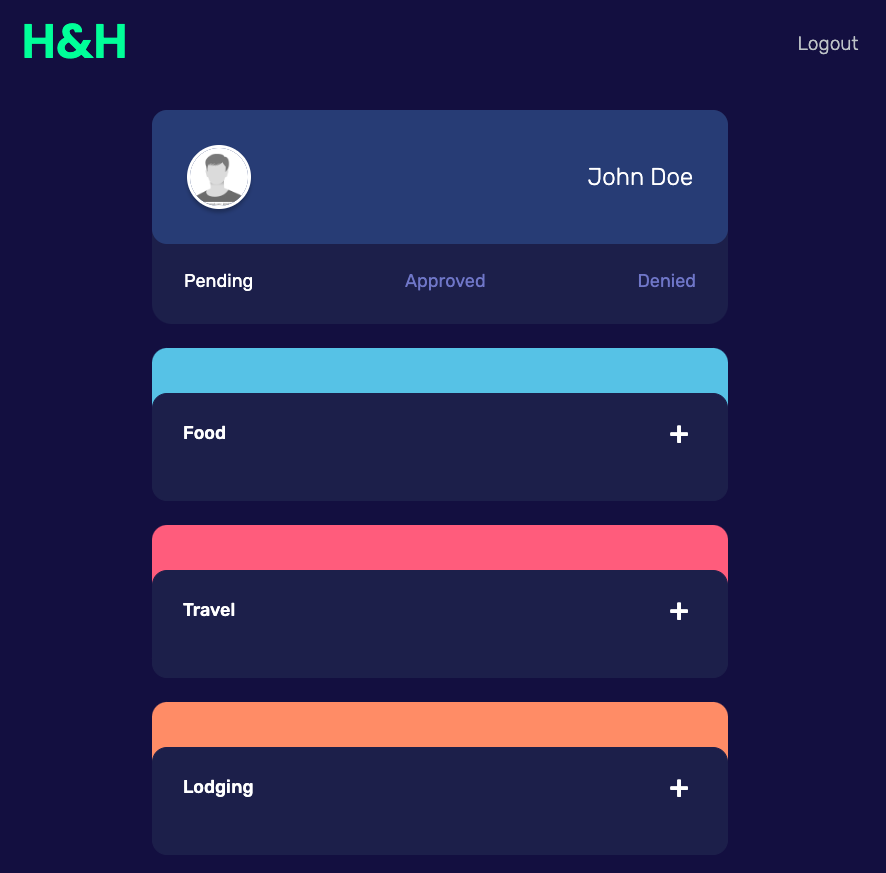

# Project 1 - Employee Reimbursment System (ERS)

## Executive Summary

The Expense Reimbursement System (ERS) will manage the process of reimbursing employees for expenses incurred while on company time. All employees in the company can login and submit requests for reimbursement and view their past tickets and pending requests. Finance managers can log in and view all reimbursement requests and past history for all employees in the company. Finance managers are authorized to approve and deny requests for expense reimbursement. The reimbursement types should have the following options: LODGING, FOOD, TRAVEL

# Tech Stack

- Java 8
- Apache Maven
- PostgreSQL
- AWS RDS
- Java Servlets
- JDBC
- HTML
- CSS
- JavaScript
- AJAX / Fetch API

## Achievements

### Front-end:
#### UI/UX
##### Homepage

##### Login Page

##### Register page

##### New reimbursement page

##### View all reimbursements page

##### Approved reimbursement page

##### Admin page

* Use HTML, CSS, and JavaScript to create a front-end for the application.
* Use jwt to create a session token for the user.

### Back-end:
#### Architecture and Entity-Relationship Diagram

* Employees,admins and Reimbursements are stored in a relational database.
* All CRUD functionality accessible via RESTful API
* Validate all user input
* Unit test coverage for service-layer classes.
* Integration tese coverage for dao-layer classes.
* The persistence layer  use JDBC to translate between the database and the application server. 
* The API layer using java servlets.
* The servlets container uses Tomcat to run the application. 
* The server follow a  controller-service-repository architecture.
* The client and server communicate in a RESTful manner.
* The server is stateless.
* The Authentication layer uses JWT to create a session token for the user.
* The Encription layer uses bcrypt to hash the password.

#### Restful API
##### Employee
* GET /users/{id}
* GET /users
* POST /users
* PUT /users/{id}

##### Reimbursement
* GET /reimbursements/{id}
* GET /reimbursements
* GET /reimbursements?status_id={id}
* POST /reimbursements
* PUT /reimbursements/{id}
* DELETE /reimbursements/{id}

##### Admin
* POST /reimbursements/{id}?status_id={id}

## User Story
#### Guest:
- As a guest, I can register for a new account
- As a guest, I can log into my account

#### User:
- As a user, I can submit a request for reimbursement
- As a user, I can cancel a pending request for reimbursement
- As a user, I can view my pending and completed past requests for reimbursement
- As a user, I can edit my pending requests for reimbursement

#### Admin/Finance Manager:
- As an admin, I can approve expense reimbursements
- As an admin, I can deny expense reimbursements
- As an admin, I can filter requests by status

**State-chart Diagram (Reimbursement Statuses)**

**Logical Model**

**Physical Model**

**Use Case Diagram**

**Activity Diagram**

## Futuae Goals
* as a admin,I can change the user role.

